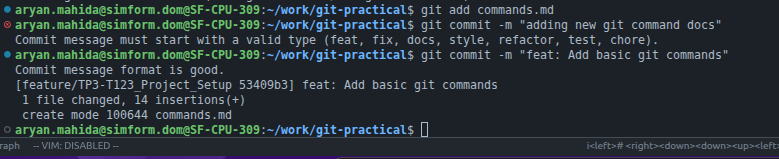
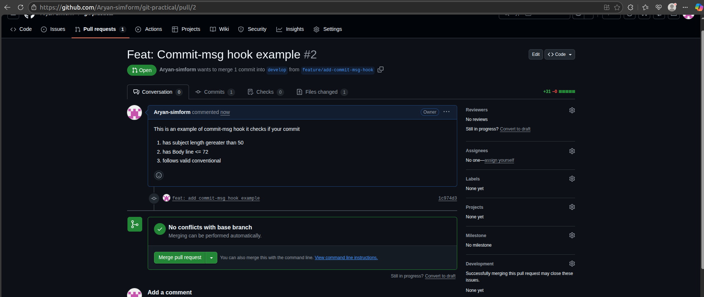
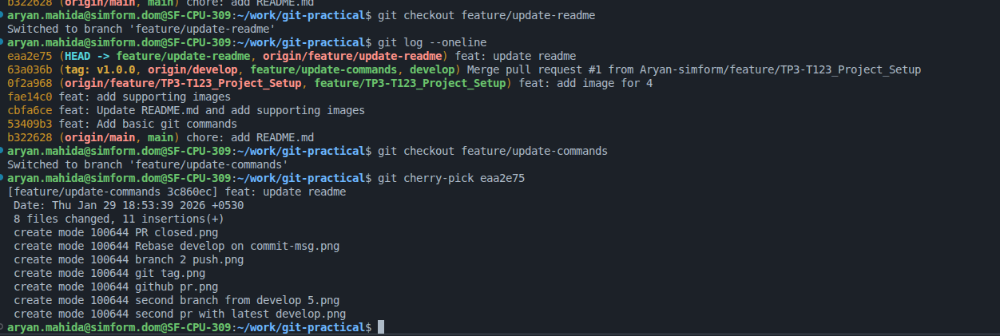

# Git Exercise:
**1.** Create a new repository with a template  

**2.** Initialize git-flow 

**3.** Create a feature branch for project setup with the proper Zoho task ID (example: TP2-T1299_Project_Setup).

 
**4.**Create a sub-branch from the project setup branch and perform squash, reset, rebase and cherrypick.
 
**Practice below mentioned scenario and decide which one to use from rebase, cherry-pick, reset or squash and how,**

1. Create a branch from the develop

2. Add a commit message hook to the repo.

Output

3. Perform multiple commits in the new branch

4. Create PR to develop.
PR should be small in size, It's recommended to do one commit per PR. However, based on the situation we can have multiple commits in PR. e.g. if someone is doing 10 bug fixes which are one-liner fixes in such cases instead of 10 different PRs you can do 10 commits in a single PR. 

5. Create another branch from develop given your previous PR is still in review state 

6. Now commit something in your current branch and push it

7. In the meantime, your previous PR has been merged to develop

8. Create a PR for the current branch given your branch should be up to date with develop branch

9. For any new build release add a version tag to that specific commit to keep track of each version.

10. Create 2 another branch (3rd and 4th) from develop, push read me changes to 3rd brach.

11. Cherry pick 3rd branch's commit to 4th branch.

12. Change commit message in 4th branch

13. add 3 commit to 4th branch and delete last commit.
    
    last 3 commit before deleting 3rd  
    after deleting 3rd commit using git revert so i don't lost my changes and can commit them on the next commit.